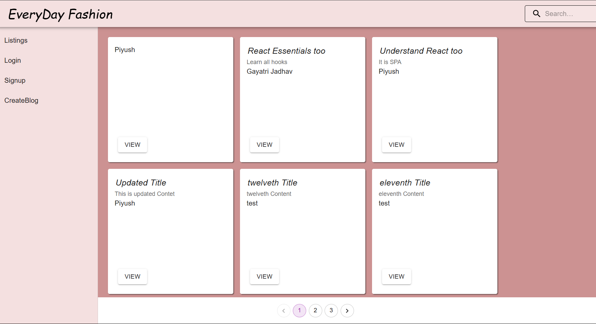

## 🚀 Project Architecture

### Tech Stack
| Component       | Technology                          | Hosting/Service         |
|-----------------|-------------------------------------|-------------------------|
| **Frontend**    | React.js                            | AWS S3 (Static Website) |
| **Backend**     | Spring Boot (REST API)              | AWS EC2 (Port 8080)     |
| **Database**    | PostgreSQL                          | Amazon RDS              |
| **CI/CD**       | Jenkins                             | Port 8000               |
| **Auth**        | JWT Authentication                  | Secure HTTP Only        |

## 🔐 Authentication Flow
- **JWT Token** stored in HTTP-only cookies for secure authentication
- Token expiration: 24 hours (configurable)
- Protected routes with role-based access control

## 🌟 Key Features
### Landing Page

- Displays all published blogs in card format
- Dynamic header that shows:
  - **Signup/Login** buttons (for anonymous users)
  - **User Menu** dropdown (for authenticated users)

### User Privileges
| Action              | Anonymous User | Logged-in User | Blog Author |
|---------------------|----------------|----------------|-------------|
| View Blogs          | ✅             | ✅             | ✅          |
| Create Blog         | ❌             | ✅             | ✅          |
| Edit Blog           | ❌             | ❌             | ✅          |
| Delete Blog         | ❌             | ❌             | ✅          |

### Profile Management
```mermaid
graph TD
    A[User Menu] --> B[Profile]
    A --> C[Logout]
    B --> D[My Blogs]
    D --> E[Edit Blog]
    D --> F[Delete Blog]
 

